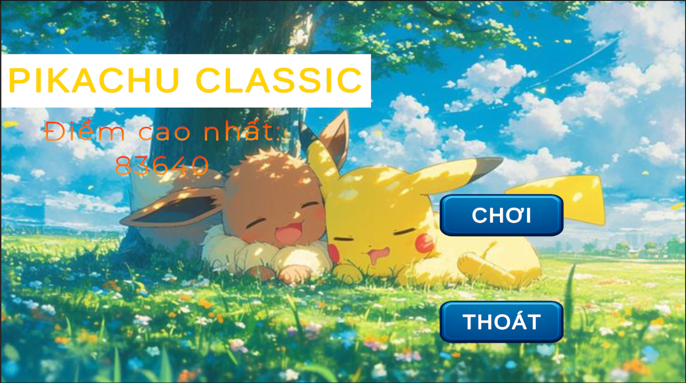
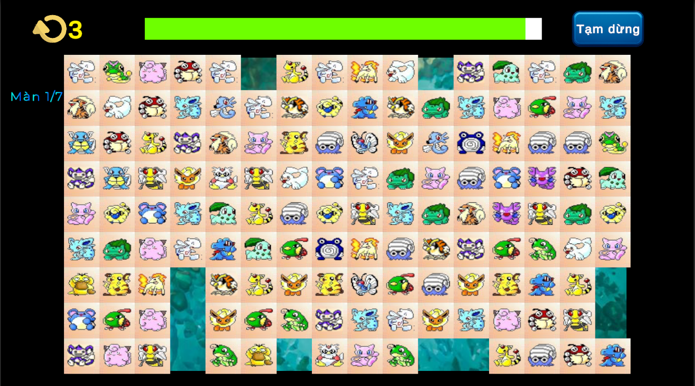
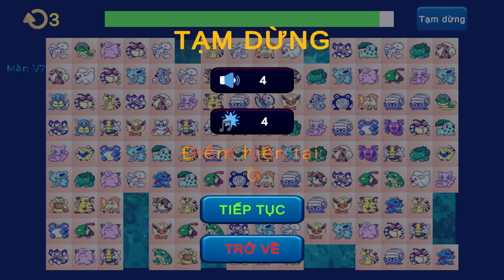
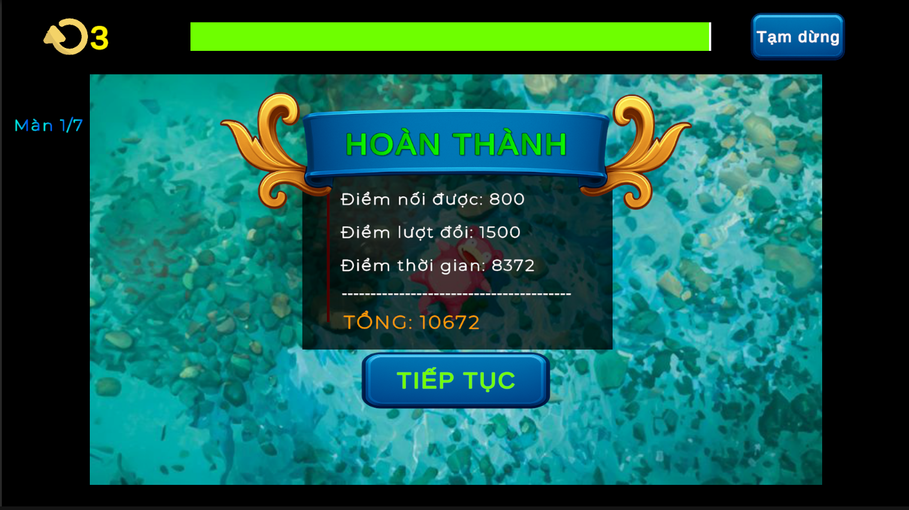
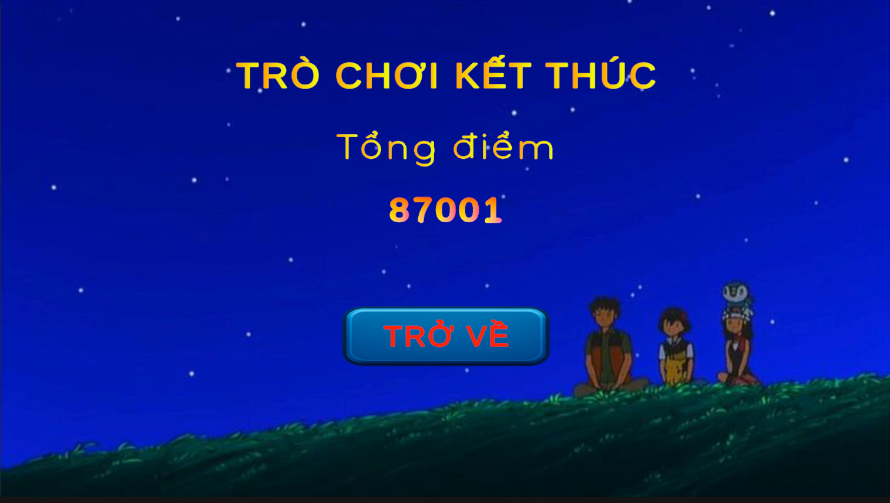

## PROJECT NAME: CLASSIC LINK PUZZLES (PIKACHU CLASSIC 2003 CLONE)— A classic 2D tile-matching puzzle game (Onet-style)

Match identical tiles that can be connected with a path of up to two turns, clear the board under time pressure, and use shuffles when you get stuck.

## Introduction

**Core experience**

Pikachu Classic is a lightweight 2D puzzle game focused on quick pattern recognition and route planning. The goal is to remove all tiles by matching pairs that can be linked by a valid path while managing time and limited shuffle resources.

**Key features**

- BFS-based connection checking that supports paths with up to **2 turns**
- Level progression driven by ScriptableObjects (board size, timer, bonuses, gravity mode, background, BGM)
- Scoring system that accounts for matches, time, and shuffle usage
- Manual shuffle + automatic shuffle when no valid pairs remain
- Simple scene flow: main menu → gameplay → game over

## Tech Stack

- **Engine**: Unity **2022.3.62f1** (2022.3 LTS)
- **Language**: C# (clean separation of responsibilities; SOLID-friendly structure)
- **Version Control**: Git

## Architecture

**Design patterns / approach**

- **Singleton-style managers** for core systems (`GameManager`, `LevelManager`, `GridManager`, `ScoreManager`, `GameTimerManager`, `ShuffleManager`, etc.)
- **Event-driven UI and flow** via C# events (e.g., level loaded, score updated)
- **ScriptableObjects** to author level data and content without hardcoding

**Project structure (high level)**

- `Assets/_Script/Core/`: game loop & progression (game, levels, timer, scoring, shuffle)
- `Assets/_Script/Grid/`: grid creation, queries, board operations (gravity, shuffle)
- `Assets/_Script/Match/`: matching/pathfinding logic
- `Assets/_Script/Pathfinding/`: BFS components / path representation & rendering
- `Assets/_Script/Tile/`: tile behaviors and tile type generation
- `Assets/_Script/UI/`: UI controllers and scene loading
- `Assets/_Script/Sound/`: BGM/music management
- `Assets/_SO/`: ScriptableObjects (level data, tile skins)
- `Assets/Scenes/`: `MainMenuScene`, `GameScene`, `GameOverScene`

## Installation

1. Clone the repository:
   - `git clone <your-repo-url>`
2. Open the project with Unity **2022.3.62f1**.
3. Open `Assets/Scenes/MainMenuScene.unity`.
4. Press **Play**.

## Media

Screenshots (from `Assets/_ScreenShot/`):

## Credits

- **Background art**: sourced from Pinterest (for learning/demo purposes).
- **Tile**: sourced from SaiGame collection.
- **UI assets**: sourced from Code Monkey.
- **Sound & Music**: sourced from SaiGame collection and on Youtube. (for learning/demo purpose)

##Demo: https://thangnoob.itch.io/classic-link-puzzles
